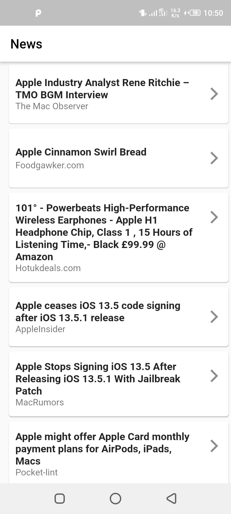

# article-reader

A flutter based mobile application that users can use to read articles

## Getting Started
- clone the project
- cd into the project directory
- enter the command "flutter pub get"
- enter the command "flutter run" to start the application

## app screen

